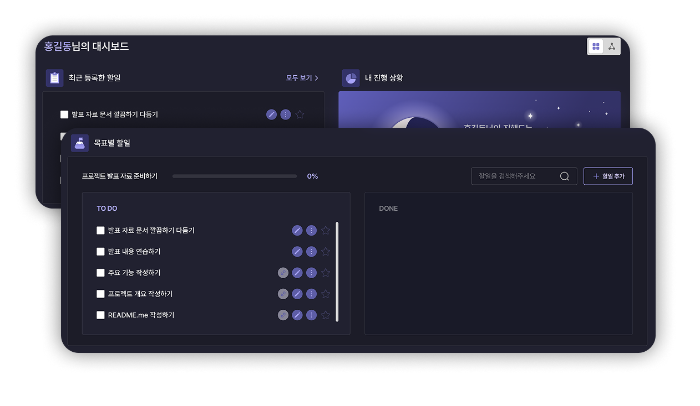
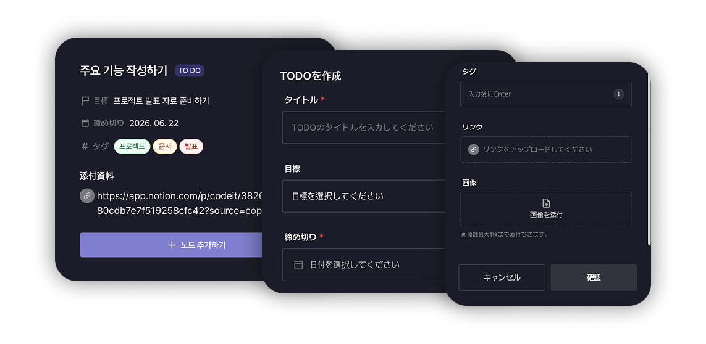

# INdigo

> 할일·목표·노트·소통을 한 곳에서 관리하는 생산성 웹 서비스

[](https://indigo-xi.vercel.app/)
[](https://github.com/Astro7145/indigo)


---

## 주요 기능

### 할일 (Todo)




날짜·카테고리·태그별로 할일을 관리합니다. 캘린더 뷰에서 날짜를 선택해 해당일의 할일을 한눈에 확인하고, 상태(할 일 → 진행 중 → 완료)를 빠르게 전환할 수 있습니다.

---

### 목표 (Goal)


목표별 진행률을 추적하고, 칸반 보드 형태로 연결된 할일을 관리합니다. 목표에 노트를 묶어 관련 자료를 한 곳에서 볼 수 있습니다.

---

### 노트 (Note)


Tiptap 기반 리치 텍스트 에디터로 노트를 작성합니다. URL을 붙여넣으면 링크 프리뷰가 자동으로 임베드되며, 목표와 연결해 체계적으로 정리할 수 있습니다.

---

### 소통 게시판 (Post)


팀 소통용 게시글을 작성하고 검색합니다. 이미지 첨부, 댓글, 노트 내용 공유 기능을 제공합니다.

---

### 즐겨찾기 & 캘린더


자주 쓰는 할일·목표·노트를 즐겨찾기로 빠르게 접근하고, 캘린더에서 일정을 한눈에 파악합니다.

---

## 기술적 하이라이트

### React Compiler 도입

React 19의 React Compiler를 프로젝트 전체에 적용했습니다. 기존에는 렌더링 최적화를 위해 `useMemo`·`useCallback`을 수동으로 작성해야 했지만, 컴파일 타임에 자동으로 메모이제이션이 적용되어 코드 복잡도와 실수 가능성을 동시에 줄였습니다.

### HttpOnly 쿠키 인증

인증 토큰을 `localStorage`나 클라이언트 JS 메모리에 저장하지 않고, Next.js Route Handler를 중간 레이어로 두어 **HttpOnly 쿠키**로만 관리합니다. JavaScript 코드가 토큰에 직접 접근할 수 없어 XSS 공격에 의한 토큰 탈취 위협을 차단합니다.

### SSR Prefetch 전략

서버 컴포넌트에서 TanStack Query의 `prefetchQuery`를 호출하고 `dehydrate` / `HydrationBoundary` 패턴으로 서버 캐시를 클라이언트에 전달합니다. 사용자가 페이지에 진입할 때 로딩 스피너 없이 데이터가 즉시 표시되어 초기 로딩 UX를 크게 개선했습니다.

### 다크모드

`next-themes`로 시스템 테마를 자동 감지하고, 설정에서 수동 전환도 지원합니다. 색상·타이포그래피는 Tailwind CSS v4의 `@theme` CSS 변수(브랜드 `indigo` 스케일)로 정의해 하드코딩 없이 전체 테마가 일관되게 전환됩니다.

### 다국어(i18n) 지원

`next-intl`로 한국어·영어 런타임 전환을 지원합니다. 메시지 파일을 언어별로 분리 관리하며, 설정 모달에서 선택 즉시 페이지 새로고침 없이 언어가 전환됩니다.

---

## 기술 스택

| 분류            | 기술                                                 |
| --------------- | ---------------------------------------------------- |
| 프레임워크      | Next.js 16 (App Router), React 19.2 (React Compiler) |
| 언어            | TypeScript (strict)                                  |
| 스타일          | Tailwind CSS v4                                      |
| 서버 상태       | TanStack Query v5                                    |
| 클라이언트 상태 | Zustand v5                                           |
| HTTP            | axios                                                |
| 폼·검증         | react-hook-form + Zod                                |
| 에디터          | Tiptap                                               |
| 애니메이션      | Motion                                               |
| 인증            | NextAuth.js (HttpOnly 쿠키)                          |
| 다국어          | next-intl                                            |
| 테스트          | Jest + React Testing Library, Playwright (E2E)       |

---

## 시작하기

### 1. 환경 변수 설정

```bash
cp .env.example .env
# .env 파일에 값을 채워주세요
```

### 2. 설치 및 실행

```bash
npm install
npm run dev   # http://localhost:3000
```

### 명령어

| 명령어             | 설명                    |
| ------------------ | ----------------------- |
| `npm run dev`      | 개발 서버 실행          |
| `npm run build`    | 프로덕션 빌드           |
| `npm run lint`     | ESLint 검사             |
| `npm test`         | 단위·통합 테스트 (Jest) |
| `npm run test:e2e` | E2E 테스트 (Playwright) |
